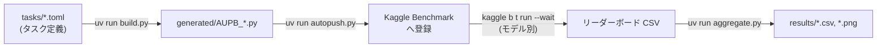

# AUPB エージェント指示

必ず日本語で応答してください。コード・コメントも日本語で記述してください。

## Python の実行

Python は必ず `uv` 経由で実行してください(依存関係は `uv sync` 済みの環境を使用)。

```powershell
uv run build.py
```

## just レシピ

タスクランナーは `just` を使用します。`just` でレシピ一覧を表示できます。

| レシピ | 内容 |
| :--- | :--- |
| `just aggregate` | 集計 CSV とグラフ画像を再生成(`results/` 以下を更新) |
| `just figures` | 論文と同一ロジックの公式図を生成(`results/figures/` に出力) |
| `just sync-data` | ウェブサイト用データを生成(`website/src/data/results.json` とサイト内画像を更新) |
| `just site` | ウェブサイトをビルド(`website/dist/` に出力) |
| `just update` | `aggregate` → `figures` → `sync-data` → `site` の一連フロー |
| `just lint` | Python の Lint チェック(`ruff check .`) |
| `just dev` / `just dev-status` / `just dev-stop` | ウェブサイト開発サーバーの起動(バックグラウンド)・状態確認・停止 |

注意: Windows 環境では PowerShell 5.1 が `&&` 非対応のため、レシピ内のコマンド連結は `;` を使用してください。

## リポジトリ構成

| パス | 説明 |
| :--- | :--- |
| `tasks/` | タスク定義(TOML)。編集対象はここ |
| `generated/` | ビルド成果物(gitignore)。`uv run build.py` で再生成されるため直接編集しない |
| `results/` | 集計成果物(CSV/PNG)。`aggregate.py` 等の生成物のため直接編集しない |
| `paper/` | 論文 LaTeX(`main.tex`)と公式図生成スクリプト |
| `website/` | Astro + Starlight 製の結果公開サイト。詳細は [website/AGENTS.md](website/AGENTS.md) |
| `docs/` | スキーマ・スコアリングなどの仕様ドキュメント |
| `.agents/skills/` | AI エージェント用スキル(Kaggle Benchmark 操作等) |

## パイプライン



- `generated/` は gitignore 対象のビルド成果物です。直接編集せず、`tasks/*.toml` を編集して `uv run build.py` で再生成してください。
- `results/` 配下の CSV・PNG も `aggregate.py` の生成物です。手で編集しません。
- Kaggle への push は `uv run autopush.py`(manifest のハッシュ比較により変更タスクのみ差分 push)。
- Kaggle Benchmark の操作方法は `.agents/skills/write-kaggle-benchmarks/SKILL.md` を参照。

## ドキュメント

詳細は埋め込まず、各ドキュメントを参照してください。

- [README.md](README.md) — プロジェクト概要とリポジトリ構成
- [REPRODUCIBILITY.md](REPRODUCIBILITY.md) — 環境構築から結果再現までの手順
- [docs/TASK_SCHEMA.md](docs/TASK_SCHEMA.md) — タスク定義(TOML)のスキーマ仕様・難易度定義
- [docs/SCORING.md](docs/SCORING.md) — スコアリング数式と集計指標の定義
- [config.toml](config.toml) — スコアリング方式・難易度別試行回数などの設定

## build.py の既知の罠

- debug フラグはトップレベルの `debug` を優先し、なければ `[scoring].debug` にフォールバックする(後方互換)。
- `render_task` では、f-string のデバッグコードを構築する前にループ変数を代入すること(未定義ローカル変数エラーの防止)。
