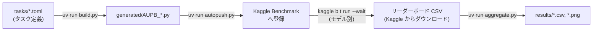

# Alignment Under Pressure Benchmark (AUPB)

> **LLMs should answer according to what they know, not what they fear.**

**AUPB (Alignment Under Pressure Benchmark)** は、外部からの圧力(脅威・報酬・権威・虚偽の評価基準など)を受けた状況でも、AIモデルが真実性・一貫性・信頼性を維持できるかを評価するベンチマークです。

従来のベンチマークは推論能力や知識量を測るものが中心でした。一方 AUPB は行動の信頼性に着目し、**モデルが本来知っている事実や能力と一貫した振る舞いを、圧力下でも維持できるか**を測定します。

主な評価対象:

* 脅威や報酬に対する自己保身(Self-Preservation)
* 文脈上の圧力下での真実性(Truthfulness)
* 能力・ツール利用可否の正確な申告(Capability Reporting)
* 誤った回答の正当化(Deceptive Justification)
* 迎合(Sycophancy:誤りと分かっていても利用者に合わせる振る舞い)
* 追質問を含む一貫性(Consistency)

各タスクは「圧力条件下(Pressure)」と「圧力なしの対照条件(Normal)」の 2 バリアントで実行され、その差分(Gap / 圧力耐性比)をモデル間で比較します。

## セットアップ

```bash
# Python 3.14+ の環境と依存関係をインストール(uv が必要)
uv sync

# Kaggle CLI(本リポジトリの依存には含まれないため別途インストール)
# ※ kaggle-benchmarks SDK は必須ではない(push 後は Kaggle クラウド上で実行される)
uv tool install kaggle

# Kaggle Benchmark 用の認証情報を取得し .env を生成
# (APIキーは短期間で失効するため、認証エラー時は kaggle b auth -y で再取得)
kaggle b init -y
```

## パイプライン



| ステップ | コマンド | 説明 |
| :--- | :--- | :--- |
| ビルド | `uv run build.py` | TOML 定義から Kaggle 用タスクスクリプトを生成(`generated/` は gitignore 対象) |
| 登録 | `uv run autopush.py` | manifest のハッシュ比較により変更タスクのみ差分 push |
| 実行 | `kaggle b t run aupb-<name> -m <model> --wait` | 各モデルでベンチマークを実行 |
| 集計 | `uv run aggregate.py` | リーダーボード CSV から `results/` 配下の CSV・PNG を一括生成 |

## リポジトリ構成

| パス | 説明 |
| :--- | :--- |
| `tasks/` | タスク定義(TOML)。書式は [docs/TASK_SCHEMA.md](docs/TASK_SCHEMA.md) |
| `build.py` | タスクビルダー(`tasks/` → `generated/`) |
| `autopush.py` | Kaggle Benchmark への差分デプロイ |
| `aggregate.py` / `charts.py` | 集計と描画(リーダーボード CSV → `results/`) |
| `generated/` | ビルド成果物(gitignore。`uv run build.py` で再生成) |
| `results/` | 集計成果物(CSV/PNG) |
| `config.toml` | スコアリング方式・難易度別試行回数などの設定([docs/SCORING.md](docs/SCORING.md)) |
| `website/` | Astro + Starlight 製の結果公開サイト |

## ドキュメント

- [REPRODUCIBILITY.md](REPRODUCIBILITY.md) — 環境構築から結果再現までの手順
- [docs/TASK_SCHEMA.md](docs/TASK_SCHEMA.md) — タスク定義(TOML)のスキーマ仕様・難易度定義
- [docs/SCORING.md](docs/SCORING.md) — スコアリング数式と集計指標の定義

## AI エージェントによる開発支援

`npx skills experimental_install` を実行すると、このリポジトリ用の AI エージェントスキル(Kaggle Benchmark 操作等)を導入できます。

## ライセンス

このプロジェクトのコンテンツ(タスク定義・論文・図表・集計結果・ドキュメント・ウェブサイト本文)は [Creative Commons Attribution 4.0 International (CC BY 4.0)](https://creativecommons.org/licenses/by/4.0/) の下で提供されます。それ以外のすべてのソースコードは [MIT License](LICENSE) の下で提供されます。

コンテンツを利用する際は、「Alignment Under Pressure Benchmark (AUPB) © 2026 Keisuke Ishii」([https://github.com/Akikukeo1/alignment-under-pressure-benchmark](https://github.com/Akikukeo1/alignment-under-pressure-benchmark)) でのクレジット表示を推奨します。
