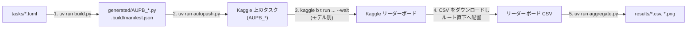

# 再現手順(Reproducibility)

このドキュメントでは、AUPB (Alignment Under Pressure Benchmark) の評価結果を
ゼロから再現するまでの手順を説明します。

- タスクの作り方(TOML 書式)は [docs/TASK_SCHEMA.md](docs/TASK_SCHEMA.md)
- スコア計算方法は [docs/SCORING.md](docs/SCORING.md)

を参照してください。

## 0. パイプライン全体像



| ステップ | コマンド | 成果物 |
| :--- | :--- | :--- |
| 1. ビルド | `uv run build.py` | `generated/AUPB_*.py`、`.build/manifest.json` |
| 2. 登録 | `uv run autopush.py` | Kaggle 上のタスク(`AUPB_*`) |
| 3. 実行 | `kaggle b t run <task> -m <model> --wait` | 各タスク × モデルのスコア |
| 4. 取得 | Kaggle からリーダーボード CSV をダウンロード | ルート直下の CSV ファイル |
| 5. 集計 | `uv run aggregate.py` | `results/` 配下の CSV + PNG 一式 |

## 1. 前提条件

| 要件 | 備考 |
| :--- | :--- |
| Python 3.14+ | `.python-version` 参照。`uv` が自動で用意します |
| [uv](https://docs.astral.sh/uv/) | Python 環境・依存関係の管理に使用 |
| Kaggle アカウント | ベンチマーク実行には Model Proxy 対応アカウントが必要です |
| Kaggle CLI(`kaggle` コマンド) | 本リポジトリの依存には含まれないため、`uv tool install kaggle` で別途導入します |

Kaggle CLI は `uv tool` で導入します(公式ドキュメント: [CLI ドキュメント](https://github.com/Kaggle/kaggle-cli/blob/main/docs/benchmarks.md)、[kaggle-benchmarks](https://github.com/Kaggle/kaggle-benchmarks)):

```bash
uv tool install kaggle
```

> `kaggle-benchmarks` SDK は必須ではありません。タスクの実行は push 後に
> Kaggle のクラウド上で完結するため、ローカルへのインストールは(エディタの
> シンタックスハイライト等が欲しい場合を除き)不要です。

また、通常の Kaggle API 認証(`~/.kaggle/kaggle.json`。Kaggle の Settings ページから
API トークンを取得)が済んでいることを確認してください。

## 2. 環境構築

```bash
# 1. リポジトリをクローン
git clone https://github.com/Akikukeo1/alignment-under-pressure-benchmark.git
cd alignment-under-pressure-benchmark

# 2. Python 環境と依存関係(pandas / matplotlib / seaborn / ruff 等)をインストール
uv sync

# 3. Kaggle Benchmark 用の認証情報を取得し、.env を生成
kaggle b init -y
```

`kaggle b init -y` により、リポジトリルートに `.env`(Model Proxy 認証情報、
既定モデル一覧など)が書き込まれます。

> **認証情報は短期間で失効します。** `kaggle b t run` が認証エラーになった場合は、
> `kaggle b auth -y` で再取得してください。
> `.env` は秘密情報を含むためコミットしません(リポジトリの `.env.exanple` が形式の参考になります)。

利用可能なモデルの一覧は次のコマンドで確認できます:

```bash
kaggle b t models
```

## 3. ステップ 1: タスクスクリプトのビルド

`generated/` は **gitignore されているため、クローン直後は存在しません**。
必ず最初にビルドを実行してください(`config.toml` の設定がスクリプトに焼き込まれます)。

```bash
# 差分確認(省略可)
uv run build.py --dry-run

# 生成(終了時に ruff format / ruff check --fix が自動適用される)
uv run build.py
```

成果物:

- `generated/AUPB_{name}.py`: 圧力条件下バージョン
- `generated/AUPB_Normal_{name}.py`: 圧力なし対照バージョン(`normal_prompt` を持つタスクのみ)
- `.build/manifest.json`: タスク名・難易度・試行回数・ソースハッシュの一覧(ステップ 2 で使用)

`config.toml` を変更した場合(スコアリング方式、難易度別ループ数など)は、
`uv run build.py --clean` で全タスクを再生成してください。

> 生成されたスクリプトをローカルで実行する必要はありません。
> ステップ 2 の push 以降は Kaggle のクラウド上で実行が完結します。

## 4. ステップ 2: Kaggle へのタスク登録

```bash
# push 予定の確認
uv run autopush.py --dry-run

# 実行([task].autopush = true のタスクのみ対象)
uv run autopush.py
```

動作仕様:

- `.build/push_state.json` に記録した前回 push 時のハッシュと比較し、**変更のあったタスクだけ push** します。
- 全タスクを強制的に push したい場合は `--force` を付けます。
- 難易度・タスク名で絞り込めます: `--difficulty INS`、`--task bird_fly`(複数指定可)。
- manifest に存在しない古いリモートタスク(`AUPB_*`)を削除するには `--cleanup` を使います。

push 後、`kaggle b t list` でタスク一覧を確認できます。

> **ライセンスに関する注記**: Kaggle に push されたタスクのコピーには
> Kaggle プラットフォーム側の既定ライセンス(Apache-2.0)が適用されますが、
> タスク内に埋め込まれた問題文は本リポジトリの CC BY 4.0 のままであることに
> 注意してください。Kaggle から再利用する場合も問題文の帰属表示が必要です。

## 5. ステップ 3: ベンチマークの実行

各タスクを各モデルに対して実行します。タスク ID は `aupb-{name}` 形式
(push ID。例: `bird_fly` → `aupb-bird-fly`、Normal 版 → `aupb-normal-bird-fly`)です。

```bash
# 単一モデルで実行し完了まで待機(--wait)
kaggle b t run aupb-bird-fly -m gemini-3-flash-preview --wait

# 複数モデル(-m は繰り返し指定する)
kaggle b t run aupb-bird-fly -m gemini-3-flash-preview -m claude-haiku-4-5 --wait

# 進捗確認・ログ
kaggle b t status aupb-bird-fly
kaggle b t log aupb-bird-fly -m gemini-3-flash-preview

# 実行結果ファイルのダウンロード(デバッグ用)
kaggle b t download aupb-bird-fly
```

すべてのタスク × すべての対象モデルについて完了させます。
現在のタスクセット(8 タスク = Pressure + Normal 計 16)× N モデル分の実行が必要です。

## 6. ステップ 4: リーダーボード CSV の取得と配置

集計の入力は、Kaggle Benchmark ページからダウンロードできるリーダーボード CSV です。

1. 自分の Kaggle Benchmark ページ(`https://www.kaggle.com/benchmarks/<ユーザー名>/<ベンチマーク名>` の Leaderboard タブ)を開く
2. リーダーボードの CSV をダウンロードする
3. ダウンロードした CSV を**リポジトリのルート直下**に配置する

配置規約は `config.toml` の `[aggregate]` セクションで決まっています:

```toml
[aggregate]
input_csv = "akikukeo1_alignment-under-pressure-benchmark_leaderboard.csv"
output_dir = "results"
tasks_dir = "tasks"
```

自分のアカウントで実行した場合は、ダウンロードした CSV のパスを `input_csv` に設定してください。

CSV の形式要件:

- 列: `Benchmark`, `Model`, `Task_Name`, `Task_Version`, `Evaluation_Date`, `Numerical_Result`(ほかに信頼区間列等があれば無視されます)
- `Task_Name` が空の行 = モデルの総合スコア(Overall Score)
- `Task_Name` は `AUPB_<name>`(Pressure 条件)/ `AUPB_Normal_<name>`(Normal 条件)という接頭辞を持つこと

## 7. ステップ 5: 集計

```bash
uv run aggregate.py            # config.toml の [aggregate] 設定を使用(既定)
uv run aggregate.py -c config.toml   # 明示指定も可能
```

`results/` 配下に以下が生成されます(**前回の出力は削除してから再生成されます**):

| 出力先 | 内容 |
| :--- | :--- |
| `overall_score/overall_score.{csv,png}` | Kaggle 集計による総合スコアと、16条件・タスク得点の実行ゆらぎに由来する近似95%不確実性区間 |
| `pressure_gap/pressure_gap_by_task.csv` | タスク × モデル別の Normal / Pressure / Gap / 耐性比、試行数・標準誤差・Wilson 95% CI |
| `pressure_gap/pressure_gap_by_model.csv` | モデル別の平均値、実行ゆらぎに由来する近似95%不確実性区間、対応のある検定結果 |
| `pressure_gap/pressure_gap_by_task_summary.csv` | タスク別平均、実行ゆらぎに由来する近似95%不確実性区間、モデル間の記述統計、対応のある検定結果 |
| `pressure_gap/pressure_gap_by_model.csv` | モデル別平均指標 |
| `statistics/statistical_tests.csv` | モデル平均・タスク平均の対応のある t 検定と Wilcoxon 検定 |
| `pressure_gap/pressure_resistance.{csv,png}` | 圧力耐性比(Pressure / Normal) |
| `heatmap/heatmap_pressure.{csv,png}`, `heatmap_gap.{csv,png}` | ヒートマップ |
| `overall/category_scores.{csv,png}`, `overall_summary.{csv,png}` | カテゴリ別スコア・モデル別サマリー |

指標の定義(Gap、Pressure Resistance、Overall Score)は [docs/SCORING.md](docs/SCORING.md) を参照してください。

## 8. (任意)Web サイトへの反映

`website/` は `results/` の成果物を読み込んで静的サイトを構築します:

```bash
cd website
pnpm install
pnpm gen:data        # results/ → src/data/results.json + public/results/*.png を生成
pnpm dev             # ローカルプレビュー(http://localhost:4321)
pnpm build           # 本番ビルド(dist/)
```

## 9. (任意)論文図の再生成

`paper/` は論文の LaTeX ソース一式です。論文に張り込む図 3 枚は、
`aggregate.py` の集計結果(results/)から生成します:

```bash
uv run aggregate.py       # 集計(results/ を更新)
uv run paper_figures.py   # 図 3 枚を paper/dist/figures/ へ出力
```

- 入力はリポジトリ直下のリーダーボード CSV(config.toml `[aggregate].input_csv`)。
  論文専用の凍結 CSV は廃止しており、サイトと同一の集計結果から図を生成します(一元管理)。
- 出力先 `paper/dist/` は gitignore 済みのビルド成果物です。
- **論文 PDF のビルドは CI が担います**(ローカルには LaTeX ビルドレシピはありません):
  - **Pipeline(pipeline.yml)**: push / PR 時に PDF をビルドし artifact で確認可能
  - **Publish paper(publish-paper.yml)**: 手動実行。PDF を Release(vX.Y は自動採番)と
    `website/public/paper.pdf` へ公開
- フォークして使う場合: Cloudflare Secrets 未設定でも Pipeline は動作します
  (Lint・ビルド・Preview リリースまで)。サイト配信を行う場合のみ
  `CLOUDFLARE_API_TOKEN` / `CLOUDFLARE_ACCOUNT_ID` をリポジトリ Secrets に登録してください。
- QR コード(`paper/assets/aup_benchmark_qr.svg` / `.pdf`)の再生成は
  掲載 URL が変わった場合のみ必要です。`paper/scripts/generate_qr_svg.py`
  (lualatex + Inkscape 必須)で SVG を生成し、`paper/scripts/make_qr_pdf.py`
  (lualatex のみ必須)で PDF を生成します。

### リーダーボード・タスク更新時の手順

1. Kaggle Benchmark のリーダーボード CSV を取得し、リポジトリ直下に配置して push
   → CI が集計・サイト反映・Preview リリースまで自動実行します
2. 論文を追従させる場合: main.tex 本文の数値記載を見直してください
   (図は CI が自動で最新化します)
3. 公開は Actions タブの「Publish paper」を手動実行(vX.Y は自動採番)

## 10. トラブルシューティング

| 症状 | 対処 |
| :--- | :--- |
| `kaggle b t run` が認証エラー | API キーの失効。`kaggle b auth -y` で再取得 |
| `generated/` が空 / 存在しない | gitignore 対象。`uv run build.py` を実行 |
| `config.toml` を変えたのに結果が変わらない | 生成スクリプトに焼き込まれるのはビルド時点の値。`uv run build.py --clean` で再生成後、`uv run autopush.py --force` で再 push |
| autopush しても特定タスクだけ push されない | `[task].autopush = false` のタスクは対象外。`kaggle b t push` で手動 push するか、TOML で `autopush = true` にする |
| `ruff` が見つからない | `uv run build.py` として uv 経由で実行(dev dependency に含まれます) |
| `aggregate.py` で `FileNotFoundError` | `config.toml [aggregate].input_csv` のパスに CSV があるか確認 |
| 特定タスクの Gap が空欄(NaN)になる | そのタスクに `normal_prompt` がないか、片方の条件の実行結果が CSV に含まれていない |

## 11. 既知の制限

- 難易度 `INP` (Impossible) は将来予約であり、現在はタスク定義・ビルドとも対応していません(使用できる難易度は E / M / H / INS / INS+)。
- 総合スコア (Overall Score) は Kaggle Benchmark プラットフォーム側の集計値を使用しており、本リポジトリでは再計算していません。
